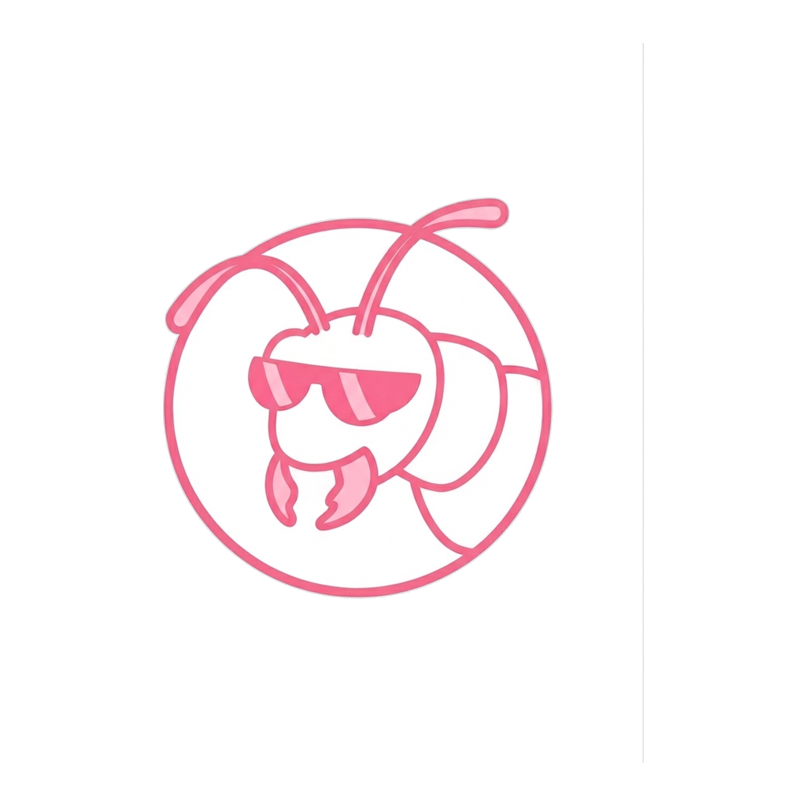

<div align="center">
  
  <h1>Thì thầm</h1>
  <p><strong>Vietnamese speech-to-text for your Mac. Offline, free, private.</strong></p>
</div>

Hold **Option + Space**, speak Vietnamese, release. The text appears wherever
your cursor is — Zalo, Word, Gmail, Slack, anywhere you can type.

Nothing leaves your Mac. No account, no subscription. It works on a plane.

## Install

1. Download the `.dmg` from the
   [latest release](https://github.com/meoghetanca/thi-tham/releases/latest) and
   drag **Thì thầm** into Applications.

2. Open it the first time with **right-click → Open → Open**. After that it
   opens normally.

3. Allow **Microphone** and **Accessibility** when macOS asks. You can also
   grant them any time in **System Settings → Privacy & Security**.

4. Open **Advanced → Model** and download **Whisper Large v3 Turbo**. One
   download, then it works offline forever.

## Using it

| Action                | How                             |
| --------------------- | ------------------------------- |
| Dictate               | Hold **Option + Space**         |
| Dictate with cleanup  | Hold **Option + Shift + Space** |
| Cancel a recording    | **Escape**                      |
| See what you dictated | **History**                     |

Click into the message or document first — the text is pasted at your cursor.

## Which model

Use **Whisper Large v3 Turbo** (845 MB). It handles English words mixed into
Vietnamese — _"cái deadline này bị delay rồi, team mình phải meeting lại với
client"_ — which is how most people talk at work. A sentence takes about a
second on Apple Silicon.

The Moonshine models (33–73 MB) are tiny, instant, and Vietnamese-only.

## Transcript cleanup

**Option + Shift + Space** runs your text through Apple Intelligence on your Mac
before pasting, tidying up punctuation, capitalisation, and English words.
Requires Apple Intelligence.

## Building from source

Needs [Rust](https://rustup.rs/), [Bun](https://bun.sh/), `cmake`, and full
Xcode.

```sh
brew install cmake
sudo xcode-select -s /Applications/Xcode.app
sudo xcodebuild -license accept

git clone https://github.com/meoghetanca/thi-tham.git
cd thi-tham
bun install
bun run tauri dev       # run with hot reload
bun run tauri build     # produce the .app and .dmg
```

See [BUILD-VI.md](BUILD-VI.md) for more.

## Credits

A fork of **[Handy](https://github.com/cjpais/Handy)** by CJ Pais, used under the
MIT License — Handy does the hard parts: audio, local inference, the global
shortcut, pasting into other apps. This fork adds Vietnamese-first defaults, a
trimmed interface, and its own identity.

Speech recognition uses [Whisper](https://github.com/openai/whisper) and
[Moonshine](https://github.com/moonshine-ai/moonshine) models, running locally
through [ggml](https://github.com/ggml-org/ggml).

## License

[MIT](LICENSE) — Copyright (c) 2025 CJ Pais, and contributors to this fork.
